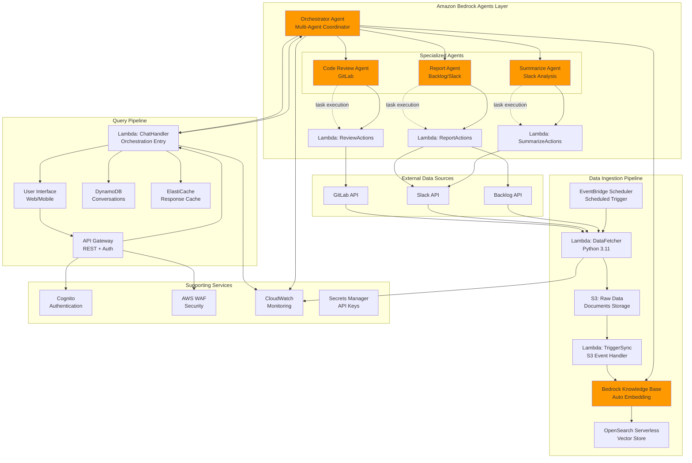

# AWS Bedrock Multi-Agent Chatbot Architecture

## 🏗️ Architecture Overview



---

## 🎯 Key Components

### 1. **Orchestrator Agent (Brain of the System)**

The Orchestrator is a Bedrock Agent that:
- **Analyzes** user questions and intent
- **Plans** execution strategy (sequential, parallel, conditional)
- **Coordinates** multiple specialized agents
- **Synthesizes** results into coherent responses
- **Handles** error recovery and fallback strategies

**Foundation Model:** `anthropic.claude-3-5-sonnet-20241022-v2:0`

**Capabilities:**
- Multi-turn conversation management
- Context-aware decision making
- Dynamic agent selection
- Result aggregation and formatting

---

### 2. **Specialized Agents**

#### **Report Agent (Backlog/Slack)**
**Purpose:** Create reports, update tickets, send notifications

**Action Groups:**
- `create_backlog_ticket` - Create new issues in Backlog
- `update_backlog_ticket` - Update existing issues
- `post_slack_message` - Send messages to Slack channels
- `create_slack_report` - Generate formatted reports in Slack

**Lambda Backend:** `ReportActionsLambda`
- Authenticates with Backlog/Slack APIs
- Validates and sanitizes inputs
- Executes CRUD operations
- Returns structured results

---

#### **Summarize & Extract Agent (Slack)**
**Purpose:** Analyze Slack conversations and extract insights

**Action Groups:**
- `get_slack_messages` - Fetch messages from channels/threads
- `summarize_discussion` - Generate discussion summaries
- `extract_action_items` - Identify tasks and decisions
- `find_mentions` - Search for specific topics/people

**Lambda Backend:** `SummarizeActionsLambda`
- Queries Slack API with filters
- Preprocesses conversation threads
- Uses LLM for summarization
- Extracts structured data

---

#### **Code Review Agent (GitLab)**
**Purpose:** Analyze code changes and provide insights

**Action Groups:**
- `get_merge_requests` - Fetch MR details
- `get_commits` - Retrieve commit history
- `analyze_code_changes` - Review code quality
- `check_standards` - Validate against coding standards

**Lambda Backend:** `ReviewActionsLambda`
- Integrates with GitLab API
- Fetches diffs and file changes
- Performs static analysis
- Generates review comments

---

### 3. **Knowledge Base Integration**

The Knowledge Base provides context for all agents:

**Data Sources:**
- GitLab: Issues, MRs, Wikis, Comments
- Slack: Channel history, threads, files
- Backlog: Issues, Wikis, Comments

**Vector Search:**
- Semantic search for relevant documents
- Hybrid search (vector + keyword)
- Metadata filtering by source/type/date
- Citation tracking

---

## 🔄 Interaction Flows

### **Flow 1: Simple Query (Single Agent)**

```
User: "What are the open bugs in project X?"

    ↓
Orchestrator Analysis:
  - Intent: Information retrieval
  - Required: Knowledge Base only
  - Agent: None (direct KB query)

    ↓
Knowledge Base Query:
  - Search: "open bugs project X"
  - Filters: source=gitlab, type=issue, status=open
  - Results: [Issue #123, Issue #456, ...]

    ↓
Orchestrator Synthesis:
  "There are 3 open bugs in project X:
   1. Issue #123: Login failure
   2. Issue #456: Payment timeout
   3. Issue #789: Data sync error"
```

---

### **Flow 2: Action Request (Agent Execution)**

```
User: "Create a Backlog ticket for the login bug"

    ↓
Orchestrator Analysis:
  - Intent: Action execution
  - Required: Report Agent
  - Parameters: title="Login bug", description=from_context

    ↓
Report Agent Execution:
  - Action: create_backlog_ticket
  - Lambda: ReportActionsLambda.create_ticket()
  - API Call: POST /api/v2/issues

    ↓
Result:
  - Ticket Created: PROJ-123
  - URL: https://backlog.com/view/PROJ-123

    ↓
Orchestrator Synthesis:
  "✅ I've created Backlog ticket PROJ-123 for the login bug.
   You can view it here: [link]"
```

---

### **Flow 3: Multi-Agent Coordination (Complex Query)**

```
User: "Summarize yesterday's Slack discussion about the payment bug,
       then create a GitLab merge request template based on the discussion"

    ↓
Orchestrator Analysis:
  - Intent: Multi-step workflow
  - Execution: Sequential (Step 2 depends on Step 1)
  - Plan:
    1. Summarize Agent → Get Slack discussion
    2. Code Review Agent → Create MR template with context

    ↓
Step 1: Summarize Agent
  - Action: get_slack_messages(channel="engineering", date="yesterday")
  - Action: summarize_discussion(messages)
  - Result: "Team discussed payment timeout bug affecting 
            webhook processing. Proposed solution: Add retry 
            mechanism with exponential backoff..."

    ↓
Step 2: Code Review Agent (with context from Step 1)
  - Action: create_mr_template(
      title="Fix payment webhook timeout",
      description=from_summary,
      checklist=["Add retry logic", "Update tests", ...]
    )
  - Result: MR template created

    ↓
Orchestrator Synthesis:
  "I've analyzed yesterday's Slack discussion about the payment bug.
   
   Summary: [detailed summary]
   
   I've created a GitLab MR template with:
   - Title: Fix payment webhook timeout
   - Description: Based on team discussion
   - Checklist: [items]
   
   You can start the merge request here: [link]"
```

---

### **Flow 4: Parallel Execution (Status Report)**

```
User: "Give me a complete project status report"

    ↓
Orchestrator Analysis:
  - Intent: Comprehensive status
  - Execution: Parallel (independent queries)
  - Plan:
    ├─ Knowledge Base → Open issues count
    ├─ Summarize Agent → Recent Slack activity
    └─ Code Review Agent → Recent commits/MRs

    ↓
Parallel Execution:
    ┌─────────────────────────────┐
    │ KB Query                    │
    │ Result: 15 open issues      │
    │ - 3 critical, 7 high        │
    └─────────────────────────────┘
    
    ┌─────────────────────────────┐
    │ Summarize Agent             │
    │ Result: 23 messages today   │
    │ Topics: Sprint planning,    │
    │         Bug fixes           │
    └─────────────────────────────┘
    
    ┌─────────────────────────────┐
    │ Code Review Agent           │
    │ Result: 5 MRs this week     │
    │ - 3 merged, 2 pending       │
    └─────────────────────────────┘

    ↓
Orchestrator Synthesis (combines all results):
  "Project Status Report - [Date]
   
   📊 Issues:
   - Total Open: 15 (3 critical, 7 high, 5 medium)
   - Blocked: 2 issues waiting for review
   
   💬 Team Activity (Slack):
   - 23 messages today
   - Main topics: Sprint planning, bug fixes
   - Action items: 4 pending tasks
   
   🔧 Development Progress:
   - 5 MRs this week (3 merged, 2 under review)
   - Main changes: Payment bug fix, API refactoring
   
   Next Steps: [recommendations]"
```

---

## 🎨 Orchestrator Decision Logic

### **Intent Classification**

```python
# Pseudo-code for Orchestrator's decision process

def analyze_intent(user_question):
    """
    The Orchestrator LLM analyzes the question to determine:
    1. Intent type
    2. Required agents
    3. Execution strategy
    """
    
    intents = {
        "information_retrieval": {
            "keywords": ["what", "show", "list", "find", "search"],
            "agents": [],  # Knowledge Base only
            "execution": "direct"
        },
        "action_execution": {
            "keywords": ["create", "update", "delete", "post", "send"],
            "agents": ["Report Agent"],
            "execution": "sequential"
        },
        "analysis_request": {
            "keywords": ["analyze", "summarize", "review", "compare"],
            "agents": ["Summarize Agent", "Code Review Agent"],
            "execution": "sequential"
        },
        "complex_workflow": {
            "keywords": ["then", "after", "based on"],
            "agents": ["multiple"],
            "execution": "sequential"
        },
        "status_report": {
            "keywords": ["status", "report", "overview", "summary"],
            "agents": ["all"],
            "execution": "parallel"
        }
    }
    
    # LLM determines intent and creates execution plan
    return create_execution_plan(intents, user_question)
```

---

### **Agent Selection Matrix**

| User Intent | Knowledge Base | Report Agent | Summarize Agent | Code Review Agent |
|-------------|----------------|--------------|-----------------|-------------------|
| **"What are open issues?"** | ✅ | ❌ | ❌ | ❌ |
| **"Create a ticket"** | ✅ (context) | ✅ | ❌ | ❌ |
| **"Summarize Slack"** | ❌ | ❌ | ✅ | ❌ |
| **"Review this code"** | ✅ (standards) | ❌ | ❌ | ✅ |
| **"Create ticket from Slack bug"** | ✅ (context) | ✅ | ✅ | ❌ |
| **"Full project status"** | ✅ | ❌ | ✅ | ✅ |

---

## 🔐 Security Architecture

### **Authentication Flow**

```
User
  ↓ (email/password)
Cognito User Pool
  ↓ (JWT token)
API Gateway Authorizer
  ↓ (validated token)
Lambda: ChatHandler
  ↓ (user_id from token)
Orchestrator Agent (with user context)
  ↓ (scoped permissions)
Specialized Agents
  ↓ (API keys from Secrets Manager)
External APIs (GitLab/Slack/Backlog)
```

### **Authorization Levels**

```python
# User roles and permissions
PERMISSIONS = {
    "viewer": {
        "knowledge_base": "read",
        "report_agent": None,
        "summarize_agent": "read",
        "code_review_agent": "read"
    },
    "developer": {
        "knowledge_base": "read",
        "report_agent": "create_ticket",
        "summarize_agent": "read",
        "code_review_agent": "read_write"
    },
    "admin": {
        "knowledge_base": "read_write",
        "report_agent": "full",
        "summarize_agent": "full",
        "code_review_agent": "full"
    }
}
```

---

## 💰 Cost Breakdown

### **Monthly Cost Estimate (Production)**

| Component | Unit Cost | Usage | Monthly Cost |
|-----------|-----------|-------|--------------|
| **Bedrock Agents** |
| Orchestrator Agent | $0.015/1K input tokens | 1M tokens | $15 |
| | $0.075/1K output tokens | 500K tokens | $38 |
| Specialized Agents (3x) | Same as above | 500K tokens each | $80 |
| Knowledge Base | $0.005/query | 10K queries | $50 |
| **Lambda** |
| ChatHandler | $0.20/1M requests | 10K requests | $2 |
| Action Lambdas (3x) | $0.20/1M requests | 5K each | $3 |
| **OpenSearch Serverless** |
| Vector Collection | $0.24/OCU-hour | 2 OCU × 720h | $346 |
| **DynamoDB** |
| Conversations Table | On-demand | 1M reads/writes | $50 |
| **API Gateway** |
| HTTP API | $1.00/1M requests | 10K requests | $0.01 |
| **ElastiCache** |
| Redis t4g.small | $0.034/hour | 720 hours | $24 |
| **Other Services** |
| S3, CloudWatch, etc. | - | - | $30 |
| **TOTAL** | | | **~$638/month** |

### **Cost Optimization Tips**

1. **Cache responses** - ElastiCache reduces Bedrock API calls by 40-60%
2. **Optimize prompts** - Shorter prompts = lower token costs
3. **Knowledge Base filters** - Reduce search scope = lower costs
4. **Lambda concurrency limits** - Prevent runaway costs
5. **OpenSearch scaling** - Use 1 OCU for dev, scale up for prod

---

## 📊 Performance Metrics

### **Target SLAs**

| Metric | Target | Monitoring |
|--------|--------|------------|
| Response Time | < 3s (p95) | CloudWatch |
| Agent Execution | < 5s (p95) | X-Ray |
| Knowledge Base Query | < 1s (p95) | CloudWatch |
| API Availability | 99.9% | CloudWatch |
| Error Rate | < 1% | CloudWatch Alarms |

### **Scalability**

- **Concurrent Users:** 100+ (with reserved Lambda concurrency)
- **Requests/Second:** 100+ (API Gateway throttling)
- **Knowledge Base Size:** 100K+ documents
- **Vector Dimensions:** 1024 (Titan Embedding v2)

---

## 🔧 Monitoring & Observability

### **CloudWatch Dashboard**

```json
{
  "widgets": [
    {
      "type": "metric",
      "properties": {
        "title": "Orchestrator Performance",
        "metrics": [
          ["AWS/Bedrock", "InvocationLatency", {"stat": "Average"}],
          [".", "TokenCount", {"stat": "Sum"}],
          [".", "Errors", {"stat": "Sum"}]
        ]
      }
    },
    {
      "type": "metric",
      "properties": {
        "title": "Agent Execution",
        "metrics": [
          ["AWS/Lambda", "Duration", {"stat": "p95"}],
          [".", "Invocations", {"stat": "Sum"}],
          [".", "Errors", {"stat": "Sum"}]
        ]
      }
    },
    {
      "type": "log",
      "properties": {
        "title": "Orchestrator Reasoning",
        "query": "fields @timestamp, reasoning, selected_agents, execution_plan | sort @timestamp desc"
      }
    }
  ]
}
```

### **X-Ray Tracing**

```
User Request
  ↓ (123ms)
API Gateway
  ↓ (456ms)
Lambda: ChatHandler
  ├─ (789ms) Orchestrator Agent
  │   ├─ (234ms) Knowledge Base Query
  │   └─ (345ms) Report Agent
  │       └─ (123ms) Backlog API Call
  └─ (100ms) DynamoDB Save
Total: 1.8s
```

---

## 🚀 Advantages of This Architecture

### **1. Modularity**
- ✅ Each agent is independent and reusable
- ✅ Easy to add new agents without changing orchestrator
- ✅ Can test agents individually

### **2. Flexibility**
- ✅ Orchestrator adapts to different query types
- ✅ Supports sequential, parallel, and conditional flows
- ✅ Easy to extend with new capabilities

### **3. Scalability**
- ✅ Serverless components scale automatically
- ✅ Parallel execution for independent tasks
- ✅ Caching reduces redundant processing

### **4. Maintainability**
- ✅ Clear separation of concerns
- ✅ Single responsibility per agent
- ✅ Easy to debug with X-Ray tracing

### **5. Cost Efficiency**
- ✅ Pay only for what you use
- ✅ Knowledge Base reduces need for agent calls
- ✅ Caching minimizes Bedrock API costs

---

## 🎯 Use Cases

### **1. Development Team Assistant**
```
"Show me all high-priority bugs from this week's Slack discussions 
 and create Backlog tickets for them"
```

### **2. Code Review Automation**
```
"Review the latest merge request in project X and post a summary 
 to the #code-review Slack channel"
```

### **3. Project Management**
```
"Generate a weekly status report including:
 - Open issues breakdown
 - Slack discussion highlights
 - Code review status"
```

### **4. Knowledge Base Query**
```
"What were the main discussion points about the API refactoring?"
```

### **5. Workflow Automation**
```
"When a critical bug is mentioned in Slack:
 1. Create a Backlog ticket
 2. Assign to the relevant developer
 3. Post confirmation in Slack"
```

---

## 📈 Roadmap

### **Phase 1: Core System (Weeks 1-2)**
- [x] Knowledge Base setup
- [x] Orchestrator Agent
- [x] Basic agent framework

### **Phase 2: Specialized Agents (Weeks 3-4)**
- [ ] Report Agent
- [ ] Summarize Agent  
- [ ] Code Review Agent

### **Phase 3: Advanced Features (Weeks 5-6)**
- [ ] Multi-turn conversations
- [ ] Context management
- [ ] Error recovery

### **Phase 4: Optimization (Weeks 7-8)**
- [ ] Response caching
- [ ] Performance tuning
- [ ] Cost optimization

### **Phase 5: Production (Week 9+)**
- [ ] Security hardening
- [ ] Monitoring dashboards
- [ ] Documentation
- [ ] User training
